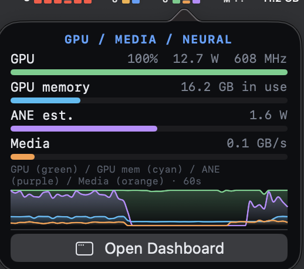
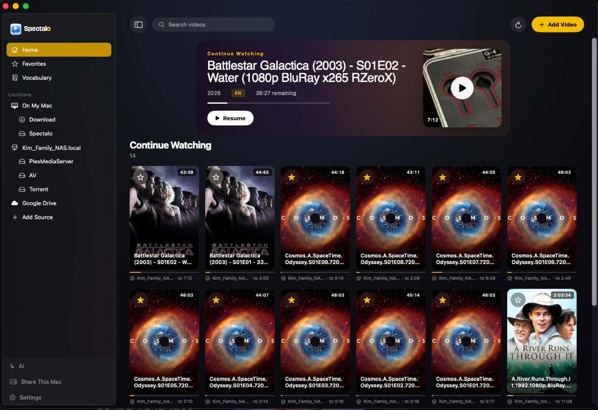

# SiliconScope

[English](README.md) · **Deutsch** · [简体中文](README.zh-CN.md) · [繁體中文](README.zh-TW.md) · [日本語](README.ja.md) · [한국어](README.ko.md)

**Ein Apple-Silicon-Systemmonitor ohne sudo** — ein natives SwiftUI-Dashboard **und** eine
vollständige Menüleisten-Suite — mit erstklassigem Tracking von **ANE (Neural Engine)**,
**Media Engine** und **Speicherbandbreite**, das die Aktivitätsanzeige und Terminal-Monitore
nicht zeigen.

Entstanden aus dem Wunsch zu *sehen*, wie On-Device-KI- und Medien-Workloads die
Apple-Silicon-Beschleuniger auslasten — und herangewachsen zu einem Alltags-Monitor, der
iStat Menus ersetzen kann.

*Vorgestellt auf [ifun.de](https://www.ifun.de/siliconscope-ueberwacht-apple-ki-neural-engine-und-speicher-in-echtzeit-282222/) (DE) und [AAPL Ch.](https://applech2.com/archives/20260620-siliconscope-apple-silicon-mac-system-monitor.html) (JP).*

*Unter einem lokalen LLM (LM Studio · Llama-3.1-8B, 100 % GPU): SiliconScope erkennt **thermisches Throttling** (GPU-Takt um −20 % gegenüber dem Spitzenwert gedrosselt), misst die Last gegen die 400-GB/s-Grenze des M1 Max, erkennt Runtime und Modell und zeigt jede Engine live — GPU / GPU-Speicher / ANE / Media sowie überlagerte Trends der E-/P-Kerne, Temperaturen pro Kern, Leistung und Bandbreite.*

### Menüleiste — jede Metrik, im iStat-Stil

Pinne jede Karte als eigenständiges Menüleisten-Element an — **CPU · GPU · Speicher · Netzwerk · SSD · Sensoren · Akku** — jeweils mit Live-Glyphe und ausführlichem Dropdown. Alles ohne sudo.

  
  
  

*Links: **GPU / Media / Neural** — GPU, GPU-Speicher, ANE und Media als Live-Anzeigen + 60-Sekunden-Trend mit 4 Linien. Mitte: Temperaturen pro Einheit — echte **E-Core- / P-Core- / GPU- / Memory**-Sensoren (pro Chip-Generation kuratierte SMC-Schlüssel, M1–M5, sonst HID-Fallback). Rechts: Akku-Gesundheit, Ladezyklen und Zustand, Aufschlüsselung der SoC-Leistung, die stromhungrigsten Apps.*

*On-Demand-Benchmark: „Measure tok/s" führt eine kurze Generierung aus und misst die Dekodiergeschwindigkeit und Energieeffizienz eines Modells — **tokens/sec · tokens/Wh** — und speichert sie pro Modell.*

> 📊 **Schon tok/s auf deinem Mac gemessen?** [Poste es in den Discussions](https://github.com/kennss/SiliconScope/discussions/5) — eine per Crowdsourcing erstellte Tabelle pro Chip hilft anderen bei der Hardware-Wahl.

## Warum ich es gebaut habe

SiliconScope ist beim Entwickeln von **[Spectalo](https://spectalo.calidalab.ai/)** entstanden,
einem On-Device-KI-Videoplayer. Um zu sehen, wie er den Chip tatsächlich auslastet, musste ich
ständig zwei Monitore gleichzeitig offen haben — und keiner hat mich überzeugt:

- **asitop / NeoAsitop** liefern zwar Werte auf Chip-Ebene, aber das TUI ist schwer lesbar und
  informationsarm.
- **btop** ist schön und dicht, zeigt aber genau das Entscheidende nicht: **ANE (Neural Engine),
  Media Engine und Speicherbandbreite**.

Zwei Fenster nebeneinander offen zu halten war lästig und Platzverschwendung. Ich wollte
NeoAsitop und btop forken, um die Lücke zu schließen — habe es dann aber lieber richtig gemacht:
**ein einziges, natives, gut lesbares GUI**, das die Apple-Silicon-spezifischen Signale zeigt und
auch ohne Terminal-Affinität verständlich ist.

Also habe ich es gebaut.

Und als es fertig war, war klar, dass ich mich endlich von **iStat Menus** verabschieden konnte,
meinem langjährigen Alltags-Monitor. Das ist **2.0** — die Version mit der vollständigen
Menüleisten-Suite, Sensoren pro Einheit und Akku-Gesundheit, die SiliconScope braucht, um iStats
Platz einzunehmen.

## Installation

**[⬇ Neuestes DMG herunterladen](https://github.com/kennss/SiliconScope/releases/latest)** und:

1. Das geladene `SiliconScope-*.dmg` öffnen
2. **SiliconScope** in den Ordner **Programme** ziehen
3. Starten

Mit Developer ID signiert + **von Apple notarisiert**, also ohne Gatekeeper-Warnung zu öffnen.
Benötigt **macOS 14+ · Apple Silicon**. Danach **aktualisiert es sich automatisch** (Sparkle) —
das ist das letzte Mal, dass du manuell ein DMG laden musst.

Wenn du selbst bauen willst, siehe [Build & run](README.md#build--run) im englischen README.

## Hauptfunktionen

- **AI-Workload-Ansicht** — ein Engpass-Klassifikator (*bandwidth-bound* / *compute-bound* /
  *thermal-throttled* / *memory-pressured*) plus eine **„% of ceiling"**-Bandbreitenanzeige pro
  Chip — beantwortet: „Was bremst mein lokales LLM gerade?"
- **E-Kern- / P-Kern-Trennung** — Auslastung pro Cluster + echte DVFS-Frequenzen
- **GPU** — Auslastung, Leistung, Frequenz
- **ANE & Media Engine** — Neural-Engine-Leistung und Medien-Codec-Bandbreite (das
  Alleinstellungsmerkmal)
- **Speicherbandbreite** — CPU / GPU / Media / gesamt GB/s (das Engpass-Signal für lokale LLMs)
- **Speicher** — gestapelte Balken aus Wired / Active / Compressed / Free + macOS-Warnung bei
  **Speicherdruck**
- **Netzwerk** ↑/↓ und **Festplatte** Lesen/Schreiben + freier Speicher, mit Live-Graphen
- **Temperaturen pro Einheit** — echte **E-Core- / P-Core- / GPU- / Memory**-Sensoren über pro
  Generation kuratierte SMC-Schlüssel (M1–M5, sonst HID-Fallback), Lüfter-RPM, thermischer Druck,
  **GPU-Throttling-Erkennung** (ob der Takt unter Druck unter dem rollierenden Spitzenwert
  gehalten wird)
- **Akku** — Ladezustand, **Gesundheit %, Ladezyklen, Zustand** (AppleSmartBattery)
- **Leistung** — pro Domäne CPU / GPU / ANE / DRAM / SoC sowie Akku
- **Prozesse** — sortieren, filtern, beenden (Scrollen innerhalb der Karte)
- **Menüleisten-Element pro Metrik** — CPU / GPU / Speicher / Netzwerk / SSD / Sensoren / Akku
  jeweils als eigene Glyphe + Dropdown anpinnen (plus die kombinierte „SS"-Cockpit-Glyphe)
- **Automatische Updates** — eingebauter Sparkle-Updater, „Check for Updates…" im Menü
- **Kein `sudo` nötig.**

## Verwandtes Projekt

**[Spectalo](https://spectalo.calidalab.ai/)** — ein schöner Videoplayer mit **On-Device**-KI-
Untertiteln und -Übersetzung (Whisper + Apple Intelligence), aus demselben Lab (Calida Lab).
SiliconScope ist beim Entwickeln davon entstanden. Kostenlose offene Beta über TestFlight —
dieselbe Haltung: nichts verlässt dein Gerät.

---

👉 Build-Anleitung, die Funktionsweise ohne sudo (IOReport / SMC / HID) und technische
Deep-Dives findest du im **[englischen README](README.md)**.

Vorschläge zur Verbesserung der Übersetzung sind jederzeit willkommen — bitte einen PR einreichen.
