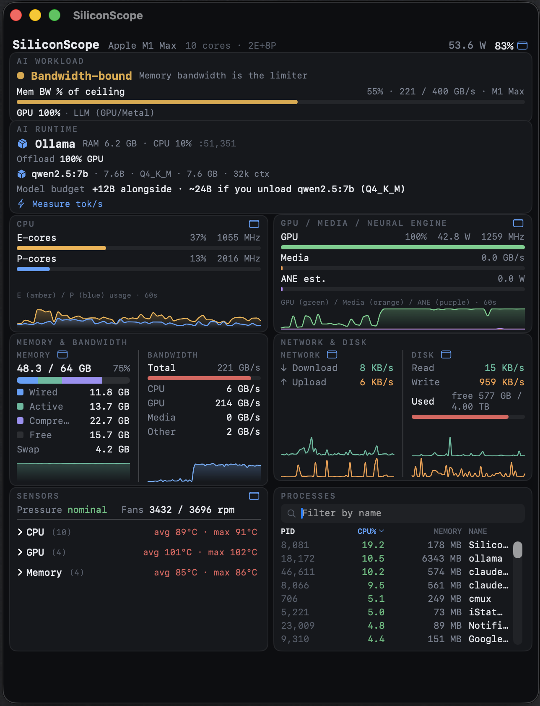
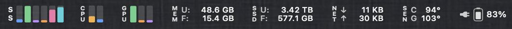
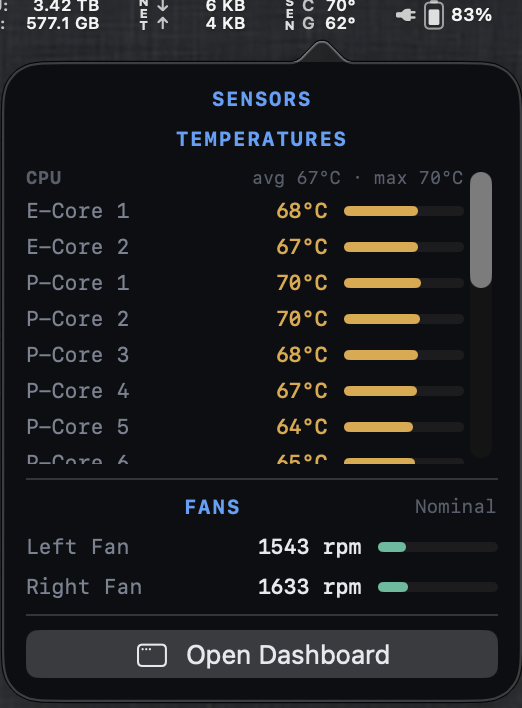
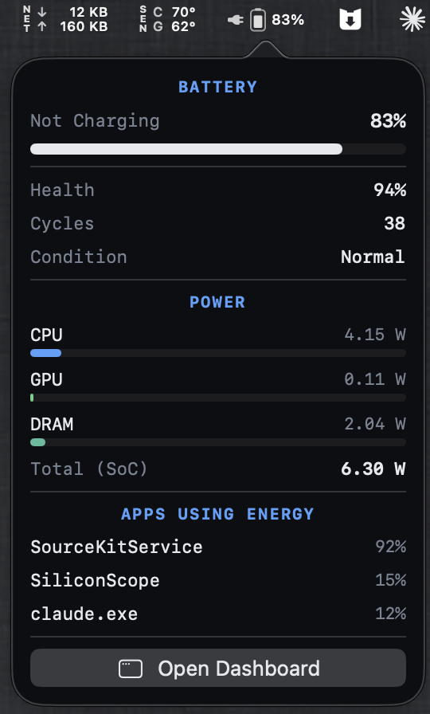

# SiliconScope

[](https://github.com/kennss/SiliconScope/releases/latest)
[](https://github.com/kennss/SiliconScope/releases)
[](LICENSE)


A **sudoless Apple Silicon system monitor** — a native SwiftUI dashboard **and** a full
menu-bar suite — with first-class **ANE (Neural Engine)**, **Media Engine**, and
**memory-bandwidth** tracking that Activity Monitor and terminal monitors don't surface.

Born from wanting to *see* how on-device AI and media workloads drive the Apple Silicon
accelerators — and grown into a daily-driver monitor that can stand in for iStat Menus.



*Under a local LLM (Ollama · qwen2.5-7B, 100% GPU): SiliconScope reads it as **bandwidth-bound** at 55% of the M1 Max's 400 GB/s ceiling, detects the runtime + model, and shows every engine live — E/P-core and GPU/Media/ANE overlaid trends, per-core temperatures, power, and bandwidth.*

### Menu bar — every metric, iStat-style

Pin any card to its own menu-bar item — **CPU · GPU · Memory · Network · SSD · Sensors · Battery** — each with a live glyph and a rich dropdown. All sudoless.



<p>
  
  
</p>

*Left: per-unit temperatures — real **E-Core / P-Core / GPU / Memory** sensors (curated SMC keys per chip generation, M1–M5; HID fallback elsewhere). Right: battery health, cycle count, condition, the SoC power breakdown, and the energy-hungry apps.*


*On-demand benchmark: "Measure tok/s" runs one short generation and reports the model's decode speed and energy efficiency — **tokens/sec · tokens/Wh** — stored per model.*

> 📊 **Measured tok/s on your Mac?** [Post it in Discussions](https://github.com/kennss/SiliconScope/discussions/5) — a crowd-sourced per-chip table helps others pick the right hardware.

## Install

**[⬇ Download the latest DMG](https://github.com/kennss/SiliconScope/releases/latest)**, then:

1. Open the downloaded `SiliconScope-*.dmg`
2. Drag **SiliconScope** into **Applications**
3. Launch it

Signed with a Developer ID and **notarized by Apple** — it opens with no Gatekeeper
prompt. Requires **macOS 14+ on Apple Silicon**. It **updates itself** from here on
(Sparkle) — this is the last DMG you download by hand.

Prefer to build it yourself? See [Build & run](#build--run).

## Highlights

- **AI Workload view** — a bottleneck classifier (*bandwidth-bound* / *compute-bound* /
  *thermal-throttled* / *memory-pressured*) with a per-chip **"% of ceiling"** bandwidth
  gauge — answers "what's limiting my local LLM right now?"
- **E-core / P-core split** — per-cluster utilization + real DVFS frequency
- **GPU** — utilization, power, frequency
- **ANE & Media Engine** — Neural-Engine power and media-codec bandwidth (the differentiators)
- **Memory bandwidth** — CPU / GPU / Media / total GB/s (the local-LLM bottleneck signal)
- **Memory** — Wired / Active / Compressed / Free stacked bar + macOS **memory-pressure** alerts
- **Network** ↑/↓ and **Disk** read/write + free space, with live graphs
- **Per-unit temperatures** — real **E-Core / P-Core / GPU / Memory** sensors via curated
  per-generation SMC keys (M1–M5; HID fallback on others), fan RPM, thermal pressure, and
  **GPU throttle detection** (clock held below its rolling peak under pressure)
- **Battery** — charge state, **health %, cycle count, condition** (AppleSmartBattery)
- **Power** — per-domain CPU / GPU / ANE / DRAM / SoC, plus battery
- **Processes** — sort, filter, kill (in-card scroll)
- **Per-metric menu-bar items** — pin CPU / GPU / Memory / Network / SSD / Sensors / Battery
  each to its own menu-bar glyph + dropdown (plus the combined "SS" cockpit glyph)
- **Auto-update** — built-in Sparkle updater; "Check for Updates…" in the menu
- **No `sudo` required.**

## Build & run

Requires macOS on Apple Silicon and the Xcode toolchain.

```bash
xcrun swift run SiliconScope        # SwiftUI GUI (dashboard + menu bar)
xcrun swift run -q sscope-cli       # data-layer verification CLI
xcrun swift build                   # build everything
scripts/build-app.sh                # create dist/SiliconScope.app locally
open dist/SiliconScope.app          # launch the local app bundle
```

> Use `xcrun`. A non-Xcode `swift` (e.g. swiftly) may not match the macOS SDK and
> will fail with `Failed to build module 'Foundation'`.

## How it works (all sudoless)

| Data | Source |
|---|---|
| Power (CPU/GPU/ANE/DRAM), residency, memory bandwidth | private **IOReport** framework (symbols resolved at runtime via dyld) |
| CPU usage | `host_processor_info` ticks (matches Activity Monitor) |
| CPU/GPU frequency | IOReport `CPU Stats` / `GPU Stats` × IORegistry DVFS table |
| Memory / swap / pressure | `host_statistics64`, `sysctl` |
| Temperatures (per-unit) | curated per-generation **SMC** FourCC keys + **HID** (`IOHIDEventSystem`) fallback |
| Fans, thermal pressure | **SMC** via IOKit |
| Network / Disk | `getifaddrs` / SystemConfiguration, mounted-volume capacities |
| Battery (charge + health/cycles/condition) | IOPowerSources + **AppleSmartBattery** (IORegistry) |
| Processes | `libproc` |

Verified IOReport channel map: [`docs/ioreport-channels.md`](docs/ioreport-channels.md).
Display spec: [`docs/display-spec.md`](docs/display-spec.md).

## Not on the Mac App Store

SiliconScope uses private (un-entitled) APIs (IOReport, SMC, HID), so it cannot be
sandboxed/notarized for the App Store. Distribute directly. This is the same
trade-off as NeoAsitop, macmon, mactop, and Stats.

## Acknowledgements

- IOReport / SMC / HID sensor knowledge referenced from **NeoAsitop** (MIT) and
  **SocPowerBuddy**; the per-generation SMC temperature key→name tables are adapted from
  **[Stats](https://github.com/exelban/stats)** (MIT). The data layer is written from
  scratch — declarations/facts referenced, no code copied.
- Auto-update by **[Sparkle](https://sparkle-project.org)**.
- Design language inspired by **btop**.

## License

MIT © 2026 Kennt Kim — see [LICENSE](LICENSE).
